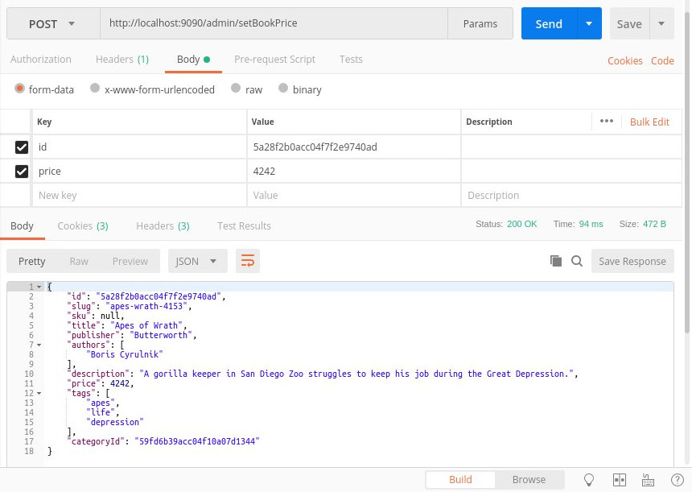
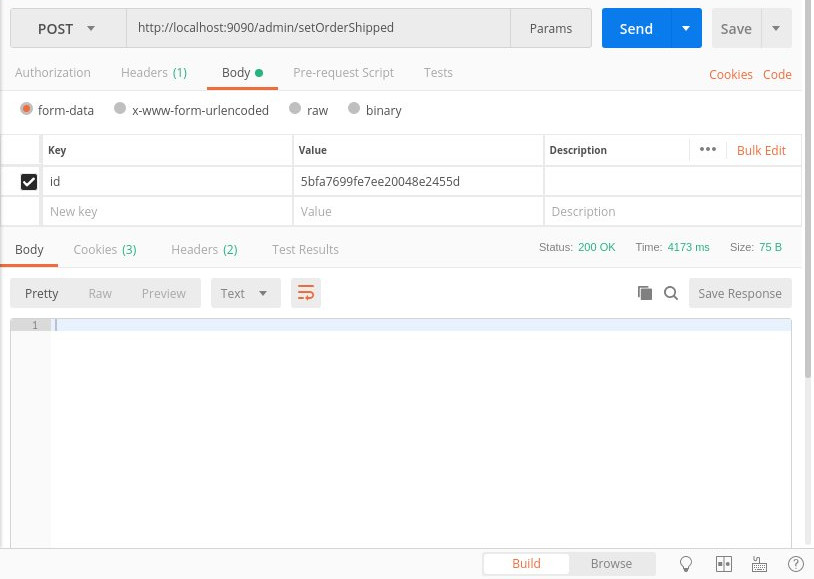

# dubersfeld-odyssey
I present here a basic Kubernetes version of the previous microservice-oriented project gutenberg-compass<https://github.com/dubersfeld/gutenberg-compass>. It consists of a collection of separate services all running in Kubernetes pods.

Here are the prerequisites for running the complete application:

A recent Docker version installed (I used 17.12.0-ce)
A recent minikube version with Virtualbox installed (I used minikube v1.0.0).
A recent Apache Maven version installed (I used 3.3.9)
A Docker MongoDB image.
A Docker Redis image.
A Docker RabbitMQ image with management UI.
A Docker Hub account.

In addition I used Spring Tool Suite for developing this demo but it is not required for running the application.

Here is the list of all 12 services:

Server            | Image                      | Port         | Function             | Database connection
---------------   | -------------------------- | ------------ | -------------------- | -------------------
rabbitmq-service  | rabbitmq:3-management      | 15672, 5672  | Messaging broker     | 
config-service    | dubersfeld/config-server   | 8888         | Configuration server | None
eureka-service    | dubersfeld/eureka-server   | 8761         | Discovery server     | None
books-mongodb     | mongo                      | 27017        | Schemaless database  |
book-service      | dubersfeld/book-server     | 8081         | Book requests        | booksonline
review-service    | dubersfeld/review-server   | 8082         | Review requests      | booksonline
order-service     | dubersfeld/order-server    | 8083         | Order requests       | booksonline
user-service      | dubersfeld/user-server     | 8084         | User requests        | booksonline
zuul-service      | dubersfeld/zuul-server     | 5555         | Gateway              | None
admin-service     | dubersfeld/admin-server    | 9090         | admin server         | booksonline
redis-service     | redis                      | 6379         | Cache                | None
frontend-service  | dubersfeld/frontend-server | 8080         | frontend             | None


Some Kubernetes persistent volumes and persistent volume claims are used. 

A gateway is used to hide some Spring servers. Here is the list:

Server           | Port | Gateway URI
---------------- | ---- | -------------------------
book-service     | 8081 | zuul-service:5555/books
review-service   | 8082 | zuul-service:5555/reviews
order-service    | 8083 | zuul-service:5555/orders
user-service     | 8084 | zuul-service:5555/users


Here are the steps to run the application:

# 1. Starting minikube with memory 8192
The default memory allocated to minikube is 2048. More memory is required. To start minikube with the required memory run these commands:
```
$ minikube stop
$ minikube delete
$ minikube start --memory 8192
``` 
The response should look like this:


# 1. Creation Spring Boot images

In each of the 9 project subdirectories:

config-server
eureka-server
book-server
review-server
order-server
user-server
zuul-server
admin-server
frontend-server

run the command: `[sudo] mvn clean package docker:build`

This will create the 9 Spring images.

In subdirectory kubernetes/booksonline run the script booksBuild.sh.

Retag all created images by replacing dubersfeld by your own Docker username and push them all.


# 2. Volumes creation

# 2.1 RabbitMQ
In subdirectory kubernetes/rabbitmq run the commands:

```
kubectl delete pvc rabbitmq-pvc
kubectl delete pv rabbitmq-pv
kubectl create -f rabbitmq-pv-hostpath.yaml
kubectl create -f rabbitmq-pvc.yaml
```

This creates a PVC and a PV for RabbitMQ persistence.

Run the command `kubectl get pods` to get the RabbitMQ pod name (the actual pod name will be different):
```
$ kubectl get pods
NAME                                READY   STATUS    RESTARTS   AGE
rabbitmq-service-75c87b458f-x5zn5   1/1     Running   0          6m34s
```

Add a port forwarding by running this command:
```
kubectl port-forward rabbitmq-service-75c87b458f-x5zn5 15672:15672
```

Connect to RabbitMQ UI on port 15672 and add a topic exchange named BookChangeTopic and a user named spring with password password1234. Grant this user access to BookChangeTopic then log out from RabbitMQ UI.

# 2.2 MongoDB
In subdirectory kubernetes/booksonline run the commands
```
kubectl delete pvc mongodb-pvc
kubectl delete pv mongodb-pv
kubectl create -f mongodb-pv-hostpath.yaml
kubectl create -f mongodb-pvc.yaml
```

# 3 Creating a ConfigMap
In subdirectory kubernetes run the command `kubectl create configmap gutenberg-config --from-file=config-repo`
This create a Config Map named gutenberg-config. It will be needed by the central configuration service.


# 4 Starting all remaining pods
In directory kubernetes run all commands below:
```
kubectl create -f run-mongodb-service.yaml
kubectl create -f run-config-service.yaml

kubectl create -f run-eureka-service.yaml
kubectl create -f run-zuul-service.yaml

kubectl create -f run-book-service-with-readinesscheck.yaml
kubectl create -f run-review-service-with-readinesscheck.yaml
kubectl create -f run-order-service-with-readinesscheck.yaml
kubectl create -f run-user-service-with-readinesscheck.yaml

kubectl create -f run-redis-service.yaml
kubectl create -f run-frontend-service-with-readinesscheck.yaml
```

This starts all service. Wait for the readiness of all services. The display should look like this:

```
$ kubectl get pods
NAME                                READY   STATUS    RESTARTS   AGE
book-service-5999975b5f-m4fnm       1/1     Running   0          7m5s
books-mongodb-67fc74ff57-86cr4      1/1     Running   0          8m28s
config-service-6db46dcfb7-8l8n6     1/1     Running   0          8m8s
eureka-service-57dbbb5c5c-vdh5h     1/1     Running   0          4m13s
frontend-service-8456966f4d-rgs2x   1/1     Running   0          2m35s
order-service-fc855d5b8-j4x7c       1/1     Running   0          5m26s
rabbitmq-service-75c87b458f-x5zn5   1/1     Running   0          33m
review-service-67986d7488-d2s6z     1/1     Running   0          6m19s
user-service-5fbb749b9c-7p4ks       1/1     Running   0          4m38s
zuul-service-549d87b76-h2zwq        1/1     Running   0          3m47s
```
Then add a new port-forward:
```
kubectl frontend-service-8456966f4d-rgs2x 8080:8080
``` 
Connect to the frontend on localhost:8080/gutenberg.

A username and password are required. Here are the prepopulated users:

Username | Password
-------- | --------- 
Carol    | s1a2t3o4r 
Albert   | a5r6e7p8o
Werner   | t4e3n2e1t
Alice    | o8p7e6r5a
Richard  | r1o2t3a4s
Sator    | sator1234 
Arepo    | arepo1234
Tenet    | tenet1234
Opera    | opera1234
Rotas    | rotas1234


To stop the application run the kubernetes command:

```
kubectl delete all --all
```

This delete all pods and services but not the persistent volumes. 

# 4. Using admin-service
To start admin-service in a Pod run the command `kubectl create -f run-admin-service.yaml` in directory kubernetes. Add a port-forward on port 9090.
To access admin-service the best way is to use Postman or any similar application. The URI is localhost:9090/admin.

Here are two snapshots of Postman interaction:






# 5. Accessing MongoDB container
To access the MongoDB container run the command:

```
kubectl exec -it books-mongodb-67fc74ff57-rw4j8 /bin/bash
```
Then in container shell run the command:

```
mongo -u spring -p password1234 --authenticationDatabase booksonline
```

and then for example to display orders collection:

```
use booksonline
db.orders.find().pretty()
```

# 6. Using Redis cache and messaging

Some frontend-server requests use Redis cache instead of a request to book-server. When a book price is changed by admin-server then a message is produced by admin-server with the book ID in the payload. This message is consumed by frontend-server that invalidate the Redis cache key for this book.


